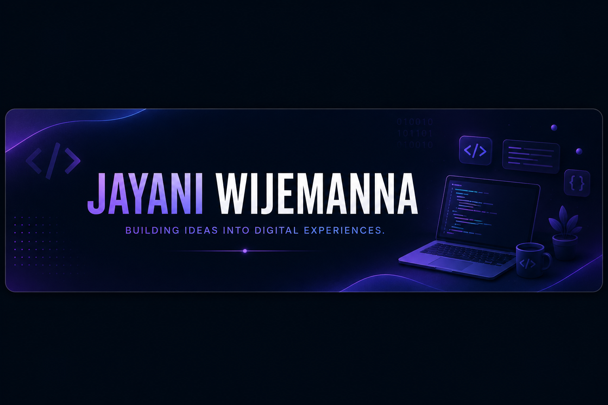

<p align="center">
  
</p>

<br>

<h2 align="center">✨ Behind the Code</h2>

```json
{
  "developer": {
    "name": "Jayani Wijemanna",
    "focus": [
      "Full-Stack Development",
      "Mobile Application Development",
      "Backend Development"
    ],
    "mindset": "Learn. Build. Improve. Repeat."
  }
}
```

---

<h2 align="center">⚡ My Developer Toolkit</h2>

<details>
<summary><b>☕ Languages I Work With</b></summary>
<br>

<p align="center">
  
</p>

</details>

<br>

<details>
<summary><b>🎨 Frontend Development</b></summary>
<br>

<p align="center">
  
</p>

</details>

<br>

<details>
<summary><b>⚙️ Backend Development</b></summary>
<br>

<p align="center">
  
</p>

</details>

<br>

<details>
<summary><b>📱 Mobile Development</b></summary>
<br>

<p align="center">
  
</p>

</details>

<br>

<details>
<summary><b>🗄️ Data & Databases</b></summary>
<br>

<p align="center">
  
</p>

</details>

<br>

<details>
<summary><b>🧰 Tools Behind My Code</b></summary>
<br>

<p align="center">
  
</p>

</details>

---

<h2 align="center">📊 GitHub Activity</h2>

<p align="center">
  
</p>

<p align="center">
  
</p>

<p align="center">
  
</p>

---

<h2 align="center">🌱 Currently Growing</h2>

<p align="center">
  React &nbsp;•&nbsp; Spring Boot &nbsp;•&nbsp; REST APIs &nbsp;•&nbsp; Software Architecture
</p>

---

<h2 align="center">🤝 Let's Connect</h2>

<p align="center">

  <a href="https://www.linkedin.com/in/jayaniwijemanna">
    
  </a>

  <a href="mailto:jayaniwijemanna54@gmail.com">
    
  </a>

</p>

<br>

<h3 align="center">💭 Code • Learn • Build • Grow</h3>

<p align="center">
  <i>Always curious. Always learning. Always building.</i>
</p>

<p align="center">
  ⭐ <b>Thanks for stopping by!</b> ⭐
</p>
